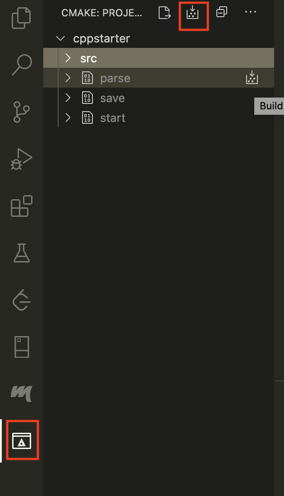

# C++ Project Starter Example

USC EE 599 - Computing Principles for Electrical Engineers, fall 2020. 

> Implement a starter code to create REST method, save file for future analysis. 

> Can be used in Visual Studio Code

## Tools
* VS Code
* [CMake](https://cmake.org/)
* [cpprestsdk](https://github.com/microsoft/cpprestsdk)
* [Alpha Vantage](https://www.alphavantage.co/documentation/) - free to register an API key
## Steps for MAC OS:

1. install [homebrew](https://brew.sh/)
2. `brew install cmake openssl cpprestsdk`
3. open Project in VS Code
4. install VSCode extensions: [CMake Tools](https://marketplace.visualstudio.com/items?itemName=ms-vscode.cmake-tools), CMake, cmake-format
5. Optional: If CMake let you to choose CPP Compiler, pick Clang.
6. [Command + Shift + P] and type `CMake: Configure`
7. This will create a subfolder called `build`. Once you do this, a new button on the left `Activity Bar` in Visual Studio Code will appear which allows you to run and debug the targets.

If you are in different OS, please refer to this [link](https://github.com/microsoft/cpprestsdk) to install packages, and from step 3 will be the same.

## Run Code

`./build/start` : save a results html file.\
`./build/parse` : parse JSON file from alpha vantage API.\
`./build/save` : save JSON from website, and parse it using JSON library provided by cpprestsdk library. 
`./build/plot` : call [matplotlib-cpp](https://github.com/lava/matplotlib-cpp), a C++ interface of python library, to draw useful figures

## Reference

Thankful for the [repo](https://github.com/ourarash/cmake-catch-vsc-template) and [video](https://www.youtube.com/watch?v=OXwsD37qHPY&feature=youtu.be) created by [ourarash](https://github.com/ourarash).